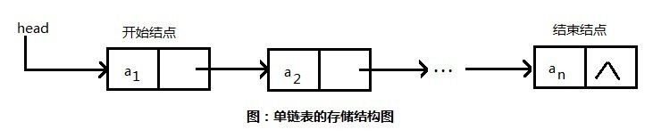

# 代码重构之多状态处理 code-refactoring

> Author: Ang

在代码里面，经常会有很多状态判断，用以区分不同的情况，这个时候，我们经常会写很多的if-else。举个栗子：

```javascript
function validate() {
    if(!this.state.password) {
        this.setState({
            error: {
                message: 'Password not inputed!',
            }
        })
        return false
    } else if(!this.state.repeatPassword) {
        this.setState({
            error: {
                message: 'Repeat Password not inputed!',
            }
        })
        return false
    } else if(this.state.repeatPassword !== this.state.password) {
        this.setState({
            error: {
                message: 'Repeat Password not match the password!',
            }
        })
        return false
    }
    
    return true
}
```

这个时候，如果有很多的状态判断，结果就会变成如下情况：

```javascript
function validate() {
    if(condition1) {
       // ...
        return false
    } else if(condition2) {
       // ...
        return false
    } else if(condition3) {
       // ...
        return false
    } else if(condition4) {
       // ...
        return false
    }
    // ...
    else if(conditionN) {
        // ...
        return false
    }
    return true
}
```

一旦条件非常多，这种代码是非常难以理解的。这是一种非常懒得的办法，一个情况就加一个if。到了后期，谁都不明白你写的是什么，包括你自己。很多人都不知道为什么要加这个if，但是不加就会出bug。所以就不停往后面加else if。

太多的if-else条件会让人晕头转向，我们的目标是减少else的情况，甚至是不要出现。

假设我们已经写好了上面的代码，那么我们一步步来重构这段代码。

首先，把各种情况分类。

* Password
* Repeat Password
* Compare the passwords

建立一个对象

```javascript
const PasswordValidationPoliciers = {
    "Password": {
        dealWithError: ()=>{
            this.setState({
                error: {
                    message: 'Error 1',
                }
            })  
        },
    },
    "RepeatPassword": {
        dealWithError: ()=>{
            this.setState({
                error: {
                    message: 'Error 2',
                }
            })  
        },
    },
    "ComparePassword": {
        dealWithError: ()=>{
            this.setState({
                error: {
                    message: 'Error 3',
                }
            })  
        },
    },
}
```

那如何找到对应的处理对象？

加个函数来查找：

```javascript
import {trim, equal} from {lodash}

const PasswordValidationPoliciers = {
	getPasswordValidationPolicy: () => {
        if(!trim(this.state.password)) {
            return PasswordValidationPoliciers['Password']
        }
        if(!trim(this.state.repeatPassword)) {
            return PasswordValidationPoliciers['RepeatPassword']
        }
        if(!equal(this.state.repeatPassword, this.state.password)) {
            return PasswordValidationPoliciers['ComparePassword']
        }
	},
    "Password": {
        dealWithError: ()=>{
            // ...
        },
    },
    "RepeatPassword": {
        dealWithError: ()=>{
            // ...
        },
    },
    "ComparePassword": {
        dealWithError: ()=>{
            // ...
        },
    },
}

function validate(){
    const passwordValidationPolicy = PasswordValidationPoliciers.
    	getPasswordValidationPolicy()
    if(passwordValidationPolicy) {
        return passwordValidationPolicy.dealWithError()
    }
    
    return true
}
```

我们可以看到，getPasswordValidationPolicy函数其实还是设计的很不好，跟每个对象耦合很强。对象一旦变化，函数也要跟着变化。我们需要让对应的对象处理自己的匹配条件，所以我们再进一步：

```javascript
const PasswordValidationPoliciers = {
	getPasswordValidationPolicy: () => {
        if(PasswordValidationPoliciers['Password'].matcher()) {
            return PasswordValidationPoliciers['Password']
        }
        if(PasswordValidationPoliciers['RepeatPassword'].matcher()) {
            return PasswordValidationPoliciers['RepeatPassword']
        }
        if(PasswordValidationPoliciers['ComparePassword'].matcher()) {
            return PasswordValidationPoliciers['ComparePassword']
        }
	},
    "Password": {
        matcher: ()=>{
           return !trim(this.state.password)
        },
        dealWithError: ()=>{
            // ...
        },
    },
    "RepeatPassword": {
        matcher: ()=>{
            return !trim(this.state.repeatPassword)
        },
        dealWithError: ()=>{
            // ...
        },
    },
    "ComparePassword": {
        matcher: ()=>{
            return !equal(this.state.repeatPassword, this.state.password)
        },
        dealWithError: ()=>{
            // ...
        },
    },
}
```

这样看起来耦合性低多了。

这样if虽然还是很多，但至少看起来明确每个条件的意义。注意，__如果有一个if条件无法用一个类名来表示清楚，那只能说这个If条件杂糅了太多东西，不应该归类在一个if条件中__。

## 下一步

虽然现在看起来已经明确很多，但是if条件太多，还是影响阅读。

这些条件都是链式的，一个条件满足，就会终止判断，并且是有顺序的判断的。这让我们想起来链表结构。



我们简单实现一个链表结构：

```javascript
class FunctionLinker {
  constructor(functions) {
    this.link = this.link.bind(this)
    
    this.startNode = null
    this.currentNode = {
      node: null,
      next: null,
    }
    if( !isNull(functions) && !isEmpty(functions)){
      functions.forEach(fn => {
        this.link(fn)
      })
    }
  }

  link(fn) {
    if (this.currentNode.node) {
      this.currentNode.next = {
        node: fn,
        next: null,
      }
      this.currentNode = this.currentNode.next
      return this.currentNode
    }

    this.currentNode.node = fn
    this.startNode = this.currentNode
    return this.currentNode
  }

  clear() {
    this.currentNode = {
      node: null,
      next: null,
    }
    this.startNode = null
  }

  crawlTheLine() {
    let _current = this.startNode
    while (_current) {
      const result = _current.node()
      if (result) {
        this.clear()
        return result
      }
      _current = _current.next
    }
    this.clear()
    return null
  }
}

export default FunctionLinker
```

改造一下我们的对象：

```javascript
const PasswordValidationPoliciers = {
	getPasswordValidationPolicy: () => {
        // some codes here
	},
    "Password": {
        linker: ()=>{
            if(PasswordValidationPoliciers['Password'].matcher()) {
              return PasswordValidationPoliciers['Password']
            }
            return null
        },
        matcher: ()=>{
           return !trim(this.state.password)
        },
        dealWithError: ()=>{
            // ...
        },
    },
    "RepeatPassword": {
        linker: ()=>{
            // codes here
        },
        matcher: ()=>{
            return !trim(this.state.repeatPassword)
        },
        dealWithError: ()=>{
            // ...
        },
    },
    "ComparePassword": {
        linker: ()=>{
            // codes here
        },
        matcher: ()=>{
            return !equal(this.state.repeatPassword, this.state.password)
        },
        dealWithError: ()=>{
            // ...
        },
    },
}
```

改造一下我们的函数：

```javascript
getVerifier: () => {
      const functionLinker = new FunctionLinker()
      functionLinker.link(PasswordValidationPoliciers['Password'].linker)
      functionLinker.link(PasswordValidationPoliciers['RepeatPassword'].linker)
      functionLinker.link(PasswordValidationPoliciers['ComparePassword'].linker)
      const result = functionLinker.crawlTheLine()

      return result
    }
```

好了。

记得Unit Test测试一下我们的类是不是可行。

```javascript
// Unit Test
describe('FunctionLinker Class', () => {
  it('should init functions', () => {
    const fn1 = function () { }
    const fn2 = function () { }
    const functionLinker = new FunctionLinker([fn1, fn2])
    expect(functionLinker.startNode).to.not.equal(null)
    expect(functionLinker.startNode.next).to.not.equal(null)
  })

  it('should link functions', () => {
    const fn1 = function () { }
    const fn2 = function () { }
    const functionLinker = new FunctionLinker()
    functionLinker.link(fn1)
    functionLinker.link(fn2)
    expect(functionLinker.startNode).to.not.equal(null)
    expect(functionLinker.startNode.next).to.not.equal(null)
  })

  it('should clear functions', () => {
    const fn1 = function () { }
    const fn2 = function () { }
    const functionLinker = new FunctionLinker()
    functionLinker.link(fn1)
    functionLinker.link(fn2)
    functionLinker.clear()
    expect(functionLinker.startNode).to.equal(null)
  })

  it('should crawl the line', () => {
    const fn1 = function () { return null }
    const fn2 = function () { return 2 }
    const fn3 = function () { return 3 }
    const fn4 = function () { return 4 }
    const functionLinker = new FunctionLinker()
    functionLinker.link(fn1)
    functionLinker.link(fn2)
    functionLinker.link(fn3)
    functionLinker.link(fn4)
    const content = functionLinker.crawlTheLine()
    expect(content).to.equal(2)
    expect(functionLinker.startNode).to.equal(null)
  })
})
```

